<div align="center">

<!-- BANNER -->


<br/>

<!-- BADGES -->
[](https://nodejs.org/)
[](https://discord.js.org/)
[](https://www.sqlite.org/)
[](#-docker-ile-kurulum)
[](LICENSE)
[](#)

<br/>

[](https://github.com/KynuxDev/Discord-Clan-Bot/stargazers)
[](https://github.com/KynuxDev/Discord-Clan-Bot/network/members)
[](https://github.com/KynuxDev/Discord-Clan-Bot/issues)

<br/>

**Discord sunucularında clan taglarını otomatik takip eden, akıllı rol yönetimi yapan,**
**streak sistemi ve canlı dashboard sunan modern bot.**

[🇬🇧 English](README.en.md) · [📖 Dokümantasyon](#-kurulum) · [🐛 Bug Raporu](https://github.com/KynuxDev/Discord-Clan-Bot/issues/new?template=bug_report.md) · [💡 Özellik Talebi](https://github.com/KynuxDev/Discord-Clan-Bot/issues/new?template=feature_request.md)

</div>

---

<div align="center">

### 🎬 Demo



</div>

---

## ✨ Öne Çıkan Özellikler

<table>
<tr>
<td width="50%">

### 🏷️ Akıllı Tag Sistemi
Event-driven + periyodik batch kontrol ile clan taglarını gerçek zamanlı takip eder. Bir sunucuda **25'e kadar** farklı tag-rol eşlemesi tanımlayabilirsiniz.

</td>
<td width="50%">

### 🔥 Streak Takibi
Kullanıcıların tagı ne kadar süredir taşıdığını takip eder. En sadık üyelerinizi streak sıralamasıyla ödüllendirin.

</td>
</tr>
<tr>
<td width="50%">

### 📊 Canlı Dashboard
Otomatik güncellenen embed dashboard ile tag istatistiklerini, üye oranlarını ve top streak'leri tek bir kanalda görüntüleyin.

</td>
<td width="50%">

### 🌍 Çoklu Dil & Sunucu
Türkçe ve İngilizce dil desteği. Her sunucu bağımsız ayarlarla çalışır — tek bot, sınırsız sunucu.

</td>
</tr>
<tr>
<td width="50%">

### 🛡️ Güvenlik Gereksinimleri
Minimum hesap yaşı ve sunucu süresi gereksinimleri ile bot hesaplarını ve yeni hesapları filtreyin.

</td>
<td width="50%">

### 📋 Audit Log
Tüm admin işlemlerini kayıt altına alır. Kim, ne zaman, ne yaptı — her şey şeffaf.

</td>
</tr>
</table>

---

## 🏗️ Mimari

```
Discord-Clan-Bot/
├── src/
│   ├── commands/          # 15+ Slash komut
│   │   ├── tag/           #   Tag CRUD işlemleri
│   │   ├── audit.js       #   Admin audit log
│   │   ├── streak.js      #   Streak bilgisi
│   │   ├── istatistik.js  #   Detaylı istatistikler
│   │   ├── siralama.js    #   Leaderboard
│   │   └── ...
│   ├── database/
│   │   ├── models/        # 7 veritabanı modeli
│   │   │   ├── guild.js   #   Sunucu ayarları
│   │   │   ├── tag.js     #   Tag-rol eşlemeleri
│   │   │   ├── member.js  #   Üye durumları
│   │   │   ├── streak.js  #   Streak verileri
│   │   │   ├── stats.js   #   İstatistikler
│   │   │   ├── auditLog.js#   Audit kayıtları
│   │   │   └── tagHistory.js # Tag geçmişi
│   │   └── migrations/    # Otomatik schema migration
│   ├── events/            # Discord event handler'lar
│   ├── services/          # İş mantığı katmanı
│   │   ├── tagChecker.js  #   Akıllı tag kontrol motoru
│   │   ├── scheduler.js   #   Zamanlayıcı servisi
│   │   ├── dashboard.js   #   Canlı dashboard
│   │   ├── welcomer.js    #   Hoşgeldin sistemi
│   │   └── logger.js      #   Loglama servisi
│   ├── locales/           # i18n (TR/EN)
│   ├── utils/             # Yardımcı fonksiyonlar
│   └── index.js           # Ana giriş noktası
├── scripts/               # Migrasyon araçları
├── Dockerfile             # Container desteği
├── docker-compose.yml     # Tek komutla deploy
└── package.json
```

---

## 📋 Komut Tablosu

| Komut | Yetki | Açıklama |
|:------|:-----:|:---------|
| `/tag-ekle <tag> <rol>` | Rolleri Yönet | Tag-rol eşlemesi ekle |
| `/tag-sil <tag>` | Rolleri Yönet | Eşlemeyi kaldır |
| `/tag-liste` | — | Tüm eşlemeleri listele |
| `/kontrol [kullanıcı]` | Rolleri Yönet | Tek kullanıcı tag kontrolü |
| `/kontrol-tumu` | Yönetici | Tüm sunucu taraması |
| `/istatistik` | — | Detaylı istatistikler + progress bar |
| `/siralama` | — | Tag süresi sıralaması (top 10) |
| `/streak [kullanıcı]` | — | Streak bilgisi |
| `/audit [sayı]` | Sunucu Yönet | Admin işlem geçmişi |
| `/yardim` | — | Komut listesi |
| `/hakkinda` | — | Bot bilgisi |
| `/ayarlar goster` | — | Mevcut ayarlar |
| `/ayarlar log-kanal <kanal>` | Sunucu Yönet | Log kanalı ayarla |
| `/ayarlar kontrol-araligi <dk>` | Sunucu Yönet | Kontrol sıklığı (1-60 dk) |
| `/ayarlar bildirim <aç/kapat>` | Sunucu Yönet | DM bildirimleri |
| `/ayarlar hosgeldin-kanal <kanal>` | Sunucu Yönet | Hoşgeldin kanalı |
| `/ayarlar hosgeldin <aç/kapat>` | Sunucu Yönet | Hoşgeldin mesajları |
| `/ayarlar dil <tr/en>` | Sunucu Yönet | Bot dili |
| `/ayarlar dashboard <kanal>` | Sunucu Yönet | Canlı dashboard kanalı |
| `/ayarlar gereksinim-hesap <gün>` | Sunucu Yönet | Min. hesap yaşı |
| `/ayarlar gereksinim-sunucu <gün>` | Sunucu Yönet | Min. sunucu süresi |

---

## 🚀 Kurulum

### Gereksinimler

- **Node.js** v18.0.0 veya üzeri
- **Discord Bot Token** ([Developer Portal](https://discord.com/developers/applications))

### Hızlı Başlangıç

```bash
# 1. Klonla
git clone https://github.com/KynuxDev/Discord-Clan-Bot.git
cd Discord-Clan-Bot

# 2. Bağımlılıkları yükle
npm install

# 3. Ortam değişkenlerini ayarla
cp .env.example .env
# .env dosyasını düzenle:
#   BOT_TOKEN=discord_bot_tokeniniz
#   DEV_GUILD_ID=test_sunucu_id  (opsiyonel)

# 4. Botu başlat
npm start
```

### 🐳 Docker ile Kurulum

```bash
# Docker Compose ile (önerilen)
docker compose up -d

# veya doğrudan Docker ile
docker build -t clan-bot .
docker run -d --name clan-bot --env-file .env -v ./data:/app/data clan-bot
```

### Discord Bot Ayarları

1. [Discord Developer Portal](https://discord.com/developers/applications) → **New Application**
2. **Bot** sekmesi → Token kopyala → `.env`'ye yapıştır
3. **Privileged Gateway Intents** → ✅ `SERVER MEMBERS INTENT`
4. **OAuth2 → URL Generator**:
   - Scopes: `bot`, `applications.commands`
   - Permissions: `Manage Roles`, `Send Messages`, `View Channels`
5. Oluşturulan URL ile botu sunucunuza ekleyin

### İlk Kullanım

```
1. /ayarlar log-kanal #bot-log          → Log kanalını ayarla
2. /tag-ekle OHIO @ClanÜyesi           → İlk tag eşlemesini ekle
3. /ayarlar hosgeldin-kanal #genel      → Hoşgeldin kanalı
4. /ayarlar hosgeldin aç                → Hoşgeldin mesajlarını aktifleştir
5. /ayarlar dashboard #clan-dashboard   → Canlı dashboard oluştur
6. Bot otomatik olarak çalışmaya başlar! 🎉
```

---

## ⚙️ Teknik Detaylar

| Özellik | Detay |
|:--------|:------|
| **Runtime** | Node.js 18+ (ESM Modules) |
| **Framework** | discord.js v14 |
| **Veritabanı** | SQLite (sql.js) — sıfır konfigürasyon |
| **Mimari** | Event-driven + Service Layer |
| **Tag Kontrolü** | Batch processing + rate limit koruması |
| **i18n** | Türkçe & İngilizce |
| **Migration** | Otomatik schema versiyonlama |
| **Shutdown** | Graceful — veri kaybı sıfır |

---

## 🔄 v1.0'dan Geçiş

v1.0 kullanıcıları mevcut verilerini otomatik olarak taşıyabilir:

```bash
# 1. Eski data.json'ı kopyala
mkdir -p database
cp /eski/yol/database/data.json database/

# 2. .env'ye eski değerleri ekle
#    V1_GUILD_ID=...
#    V1_TARGET_TAG=...
#    V1_TAG_ROLE_ID=...
#    V1_LOG_CHANNEL_ID=...

# 3. Migrasyonu çalıştır
npm run migrate
```

| | v1.0 | v2.1 |
|:--|:-----|:-----|
| Kontrol | 10sn brute-force | Akıllı batch (ayarlanabilir) |
| Veritabanı | JSON dosya | SQLite + migrations |
| Tag | Tek tag | 25'e kadar çoklu tag |
| Sunucu | Tek | Multi-guild |
| Komut | 1 | 15+ slash komut |
| Dil | Sadece TR | TR + EN |
| Dashboard | Yok | Canlı embed dashboard |
| Streak | Yok | Tam streak sistemi |
| Audit | Yok | Admin işlem kaydı |

---

## 🤝 Katkıda Bulunma

Katkılarınızı memnuniyetle karşılıyoruz! Detaylar için [CONTRIBUTING.md](CONTRIBUTING.md) dosyasına göz atın.

1. Bu repoyu **fork** edin
2. Feature branch oluşturun (`git checkout -b feature/harika-ozellik`)
3. Değişikliklerinizi commit edin (`git commit -m 'feat: harika özellik eklendi'`)
4. Branch'inizi push edin (`git push origin feature/harika-ozellik`)
5. **Pull Request** açın

---

## 📄 Lisans

Bu proje [MIT Lisansı](LICENSE) ile lisanslanmıştır. Detaylar için `LICENSE` dosyasına bakın.

---

## 💖 Destek

Bu projeyi beğendiyseniz ⭐ vermeyi unutmayın!

<div align="center">

[](https://star-history.com/#KynuxDev/Discord-Clan-Bot&Date)

**[KynuxDev](https://github.com/KynuxDev)** tarafından ❤️ ile geliştirildi.


</div>
